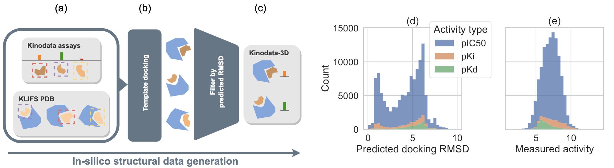

## Kinodata-3D dataset and models
This repository contains a [pyg](https://pytorch-geometric.readthedocs.io/en/latest/)-based interface
to the [Kinodata-3D dataset](https://github.com/volkamerlab/kinodata-3D) and the code used to train and evaluate the models
presented in the [Kinodata-3D publication](https://chemrxiv.org/engage/chemrxiv/article-details/658441f7e9ebbb4db96d98e8)

##
## Installation
We currently only support installation from source.
### (1) Clone this repo
### (2) Set up Python environment
Use [mamba](https://mamba.readthedocs.io/en/latest/micromamba-installation.html#umamba-install) (or conda) to set up a Python environment,
```
mamba env create -f environment.yml
mamba activate kinodata
```
and install this package in editable/develop mode
```
pip install -e .
```
### (3) Obtain raw data
The raw data, docked poses and kinase pdb files, can be obtained [from Zenodo](https://zenodo.org/records/10410259). 
After downloading the archives, extract them in the root directory of this repository.
```
cd PATH_TO_REPO
unzip ...
```
See the [Kinodata-3D repo](https://github.com/volkamerlab/kinodata-3D) for more information and the code used to generate the raw data.

## General usage
- [Kinodata-3D dataset](examples/dataset.ipynb)
- [Kinodata-3D data splits](examples/data_splits.ipynb)
- [Coming soon: Kinodata-3D models](examples/models.ipynb)

## Reproducing results
### (1) Acquire exact dataset and data split versions
If you intend to reproduce our results, we strongly recommend that you use [our preprocessed version of the dataset and corresponding data splits](https://zenodo.org/records/10410594).

### (2) Model training and evaluation
You can use the shell script `condor/train_generic.sh` to train and test a model in one run, on one particular split.
Create a file `wandb_api_key` in the root directory of this repository and paste your [wandb](https://wandb.ai/) API key,
if you want to sync results to Weight & Biases.
Otherwise, run `wandb disable` in a terminal with the conda environment activated, before training.

The script requires the following positional arguments
1. Base python script, one of `"train_dti_baseline"`, `"train_sparse_transformer"`
1. Split type, i.e. one of `"scaffold-k-fold"`, `"random-k-fold"`, `"pocket-k-fold"`.
2. Integer RMSD cutoff for the dataset, e.g. 2, 4, or 6 as used in the publication.
3. A `.yaml` file that contains additional configuration parameters, e.g. model hyperparameters.
4. The integer index of the cross-validation fold used for testing.

For instance,
```
./condor/train_generic.sh train_dti_baseline scaffold-k-fold 2 dti.yaml 0
```
trains and tests the DTI baseline on the scaffold-5-fold (default k is 5) split of the dataset
containing all complexes with predicted RMSD <= 2 Angstroms.
Folds 1-4 are used for training and fold 0 for testing.
