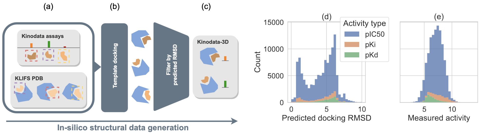

## Kinodata-3D dataset and models
This repository contains a [pyg](https://pytorch-geometric.readthedocs.io/en/latest/)-based interface
to the [Kinodata-3D dataset](https://github.com/volkamerlab/kinodata-3D) and the code used to train and evaluate the models
presented in the [Kinodata-3D publication](https://chemrxiv.org/engage/chemrxiv/article-details/658441f7e9ebbb4db96d98e8)

This branch is specific models trained to be evaluated with respect to their PLI-alignment.

**For instructions specific to this project see pli_alignment_scripts/README.md.**
